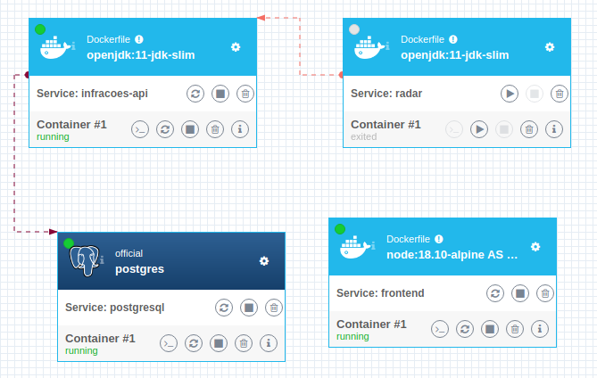

# Desafio API de Infrações
Projeto consiste em uma API REST para Infrações, um Serviço simulador de infrações que envia infrações aleatórias a cada 3 segundos para a API e um Front-end para visualização das infrações da base.
 

<h3>

</h3>

API em Java 11 com spring-boot 2.7.11, padrão MVC. 
API de Serviço Java 11 com spring-boot 2.7.11. 
Frontend em Angular 15.2.0. 
Database utiliza PostgreSQL 13. 

 
<h3>
 
<i>** powered by magrinho **</i>
</img>
</h3>

## Executando em ambiente local com Docker 🐋
A partir da pasta raiz do projeto, acesse a pasta docker-compose e execute o comando para iniciar o container:
> docker-compose up --build
>

Feito isso, verifique se os containers estão "up" e faça uma requisição na API utilizando Postman ou outro software de sua preferência:
> localhost:8080/infracoes/findAll
>

Acesse o Frontend em:
> http://localhost:8081/infracoes
>

O container postgresql é dependência do container da API, então irá iniciar antes do build, automaticamente.
Senão, utilize o comando abaixo antes de executar o backend novamente:
> docker-compose up -d postgresql
>

 

### O serviço de simulador de infrações executará ininterruptamente, enviando uma nova infração para a API a cada 3 segundos! É recomendável que pare o container "radar" após algumas inserções:
> docker-compose stop radar
>

 
 

## Executando em ambiente local com Maven
### Na raiz da pasta do backend, execute:
> mvn install
>
> mvn spring-boot:run 
> 

 

#### Ou utilize a IDE de sua preferência.

 

<h3>

 
</h3>

Para inicializar o frontend, utilize o comando:
> npm install && ng serve 
>

 

# Frontend e Estrutura de Containers

  

  

